<h1 style="text-align: center;">CampusBuzz - SOEN 357: User Interface Design</h1>

  

_CampusBuzz, your gateway to all campus events and activities_ 

## Team Members:
+ Matei Razvan Garila
+ Mohamed Bedair
+ Seif Bedair
+ Mauricio Gomez Iglesias

## The Premise
Currently, there is a disconnect between undergraduate students and the various student associations in Concordia. Usually, students must follow at least three different accounts across several social media websites just to keep up with the events they offer throughout the semester. 
This poses a severe problem since students could miss out on events that might be crucial in developping their skills or social network. At the same time, a lack of participation might result in student associations losing funding from the university. 
The objective we want to address and resolve with this project will be “How do we break the ineffective communication pattern that most student associations within the concordia community exhibit?”. 

## Hypothesis
We believe by providing a digital university-wide notice board that student associations can use to advertise the activities they offer, we will be able to increase the engagement of students in extracurricular activities.

## Goals
Our primary goal is to bridge the gap between student associations and their membership due to ineffective communication. 
To do this:
+ the design needs to be simple and easy to navigate
+ the user must be able to know what each button and navigation element does within 5-10 seconds
+ the application must use clear fonts, coloring, and clear division of web page content, thus making it inclusive to a wider audience with different disabilities such as ADHD or dyslexia
+ for associations, the main function of adding an event must be easily accessed from the home page and quick to perform

## Evaluation
Our original plan was to measure two metrics within 1 month after the app being deployed:
+ 75% of student associations should create at least 1 post about their upcoming events.
+ Posts should receive, on average, at least 45% likes with respect to the number of members, and at least 30% of members should create reminders for any upcoming event.

Ultimately, given the fact that our website is still in the prototype stage and has not yet been deployed, we decided to evaluate the likelihood of it being adopted by members of the Concordia community using an anonymous survey conducted through Google Forms. The results of this survey can be found below.

## Results

  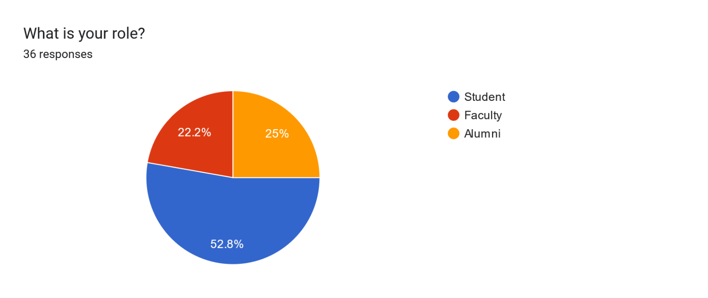 
  Fig. 1 - Distribution of Participants' Roles

  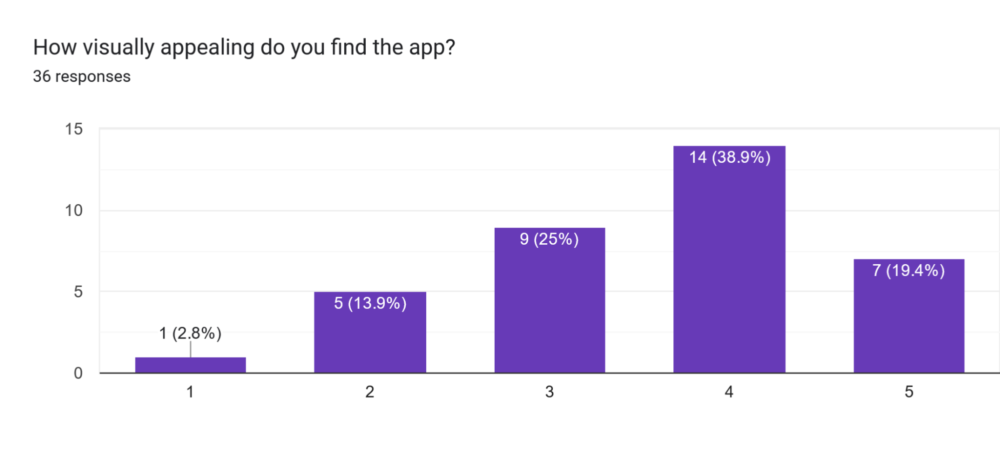 
  Fig. 2 - Score for Website's Visual Appeal

  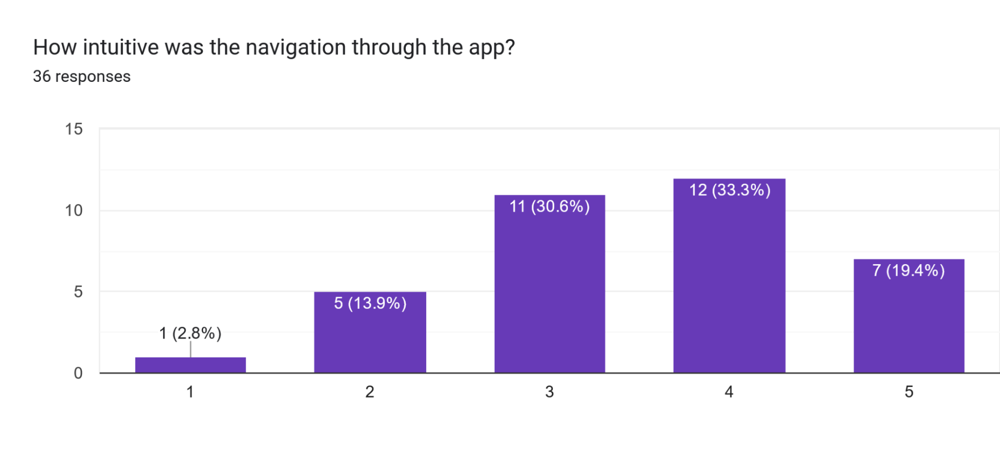 
  Fig. 3 - Score for Navigation Intuition

   
  Fig. 4 - Comments on Layout's ease of use

  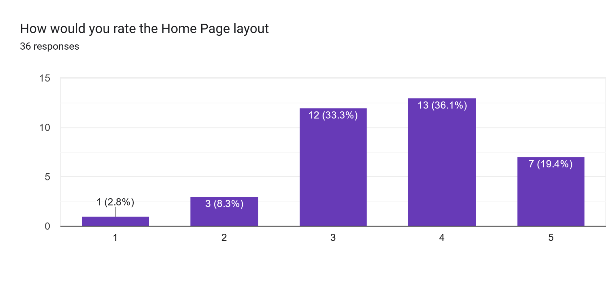 
  Fig. 5 - Score for the Home Page Layout

  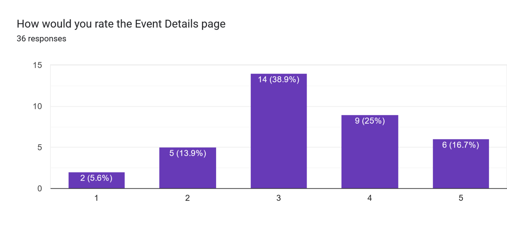 
  Fig. 6 - Score for the Events Details Page

  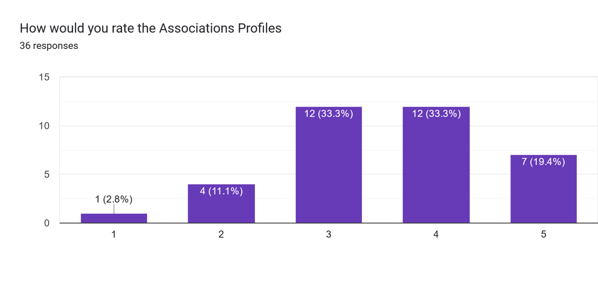 
  Fig. 7 - Score for the Association's Profile Page

  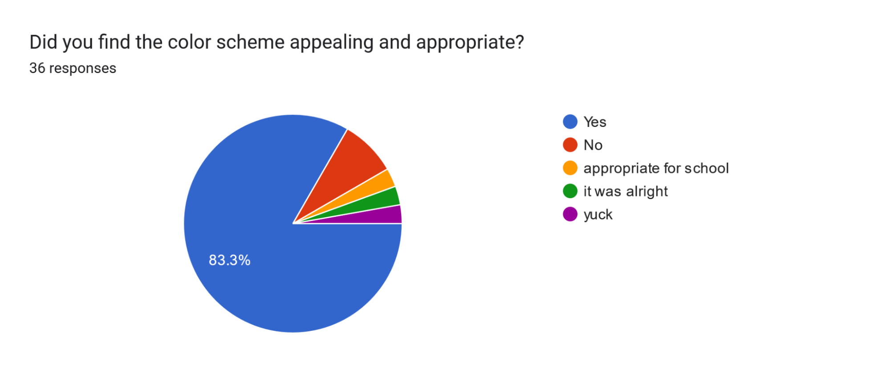 
  Fig. 8 - Comments on Appropriateness of Color Scheme

  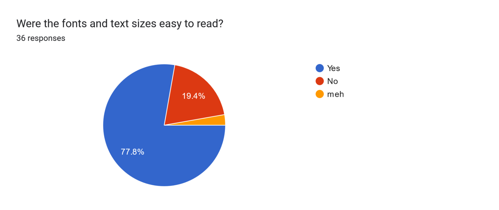 
  Fig. 9 - Comments on use of fonts

  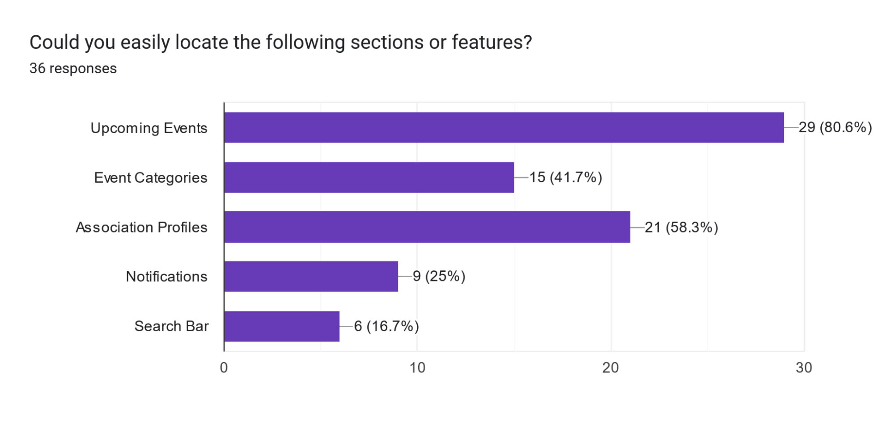 
  Fig. 10 - Feature Ease of Location

  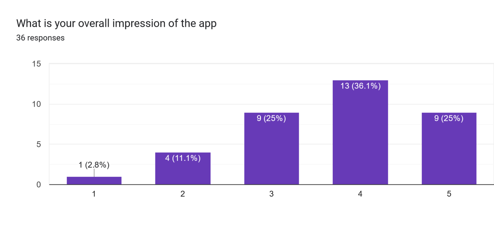 
  Fig. 11 - Overall Impression of the Website

  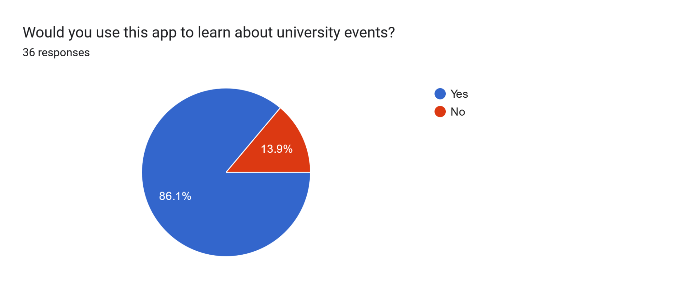 
  Fig. 12 - Using App in the Future

