<h1 style="text-align: center;">CampusBuzz - SOEN 357: User Interface Design</h1>

  

_Your gateway to all campus events and activities_ 

## Team Members:
+ Matei Razvan Garila
+ Mohamed Bedair
+ Seif Bedair
+ Mauricio Gomez Iglesias

## Table of Contents
- [The Premise](#premise)
- [Reasearch Question](#question)
- [Hypothesis](#hypothesis)
- [Goals](#goals)
- [Evaluation](#evaluation)
- [Results](#results)

## The Premise

## Research Question

## Hypothesis

## Goals

## Evaluation

## Results

   
  Fig. 1 - Distribution of Participants' Roles

  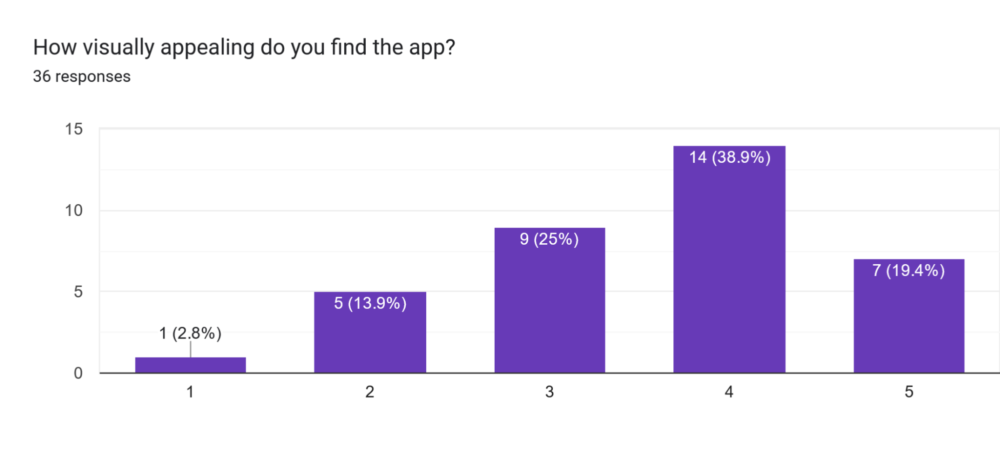 
  Fig. 2 - Score for Website's Visual Appeal

  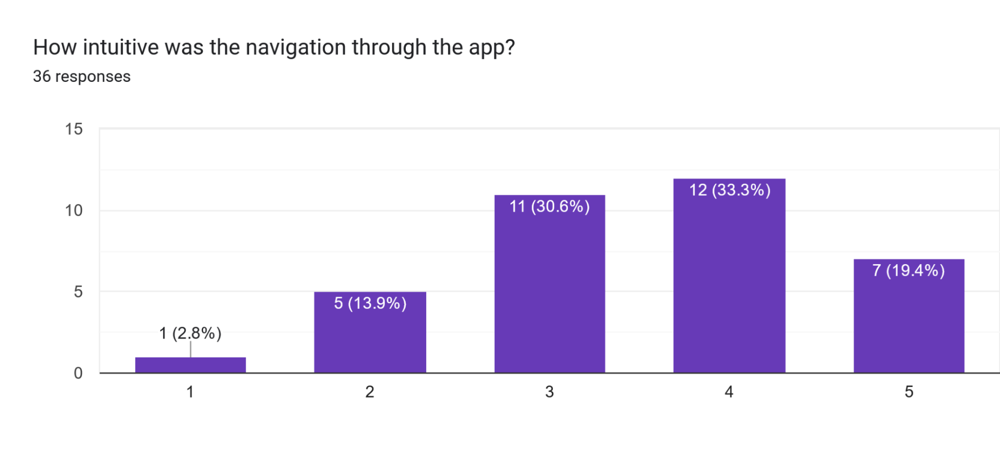 
  Fig. 3 - Score for Navigation Intuition

  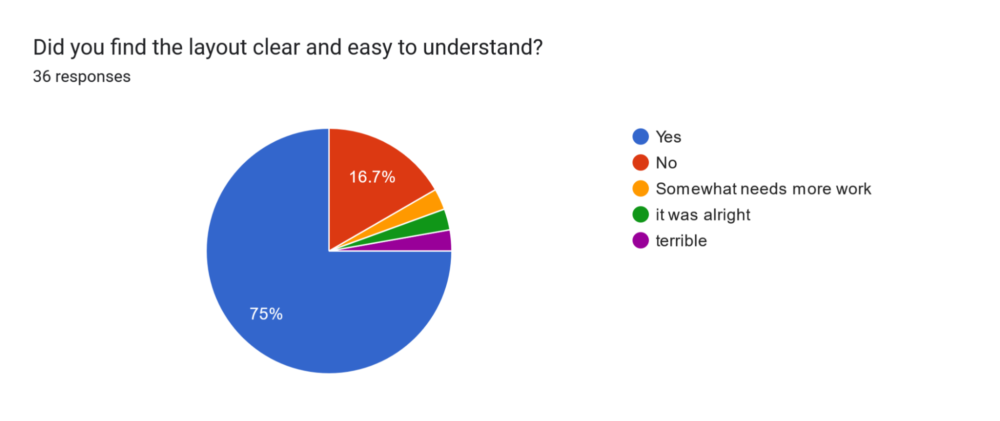 
  Fig. 4 - Comments on Layout's ease of use

  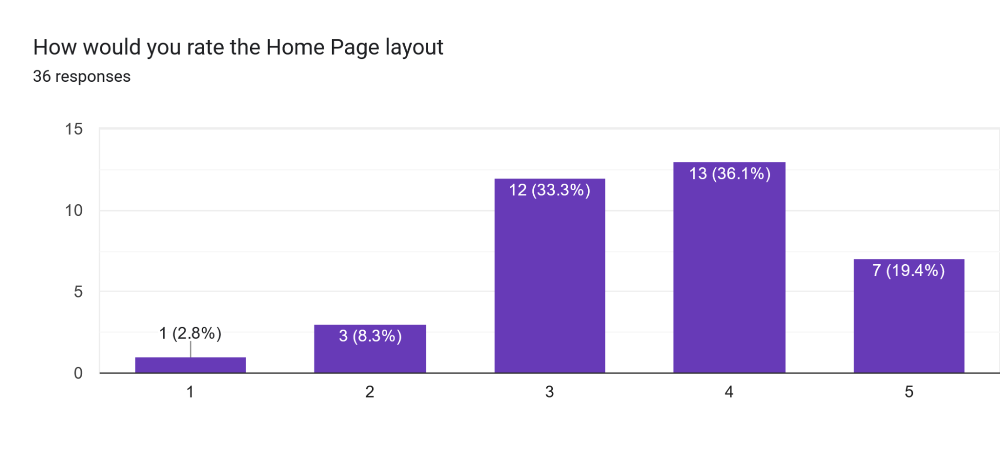 
  Fig. 5 - Score for the Home Page Layout

  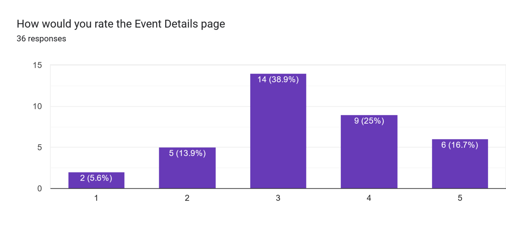 
  Fig. 6 - Score for the Events Details Page

  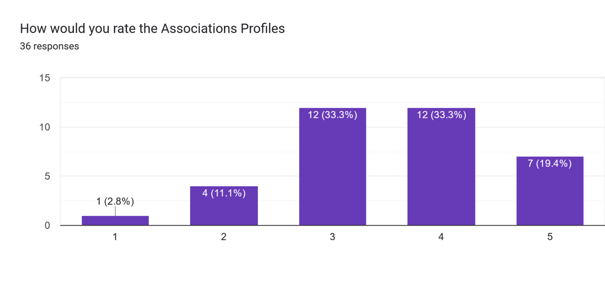 
  Fig. 7 - Score for the Association's Profile Page

  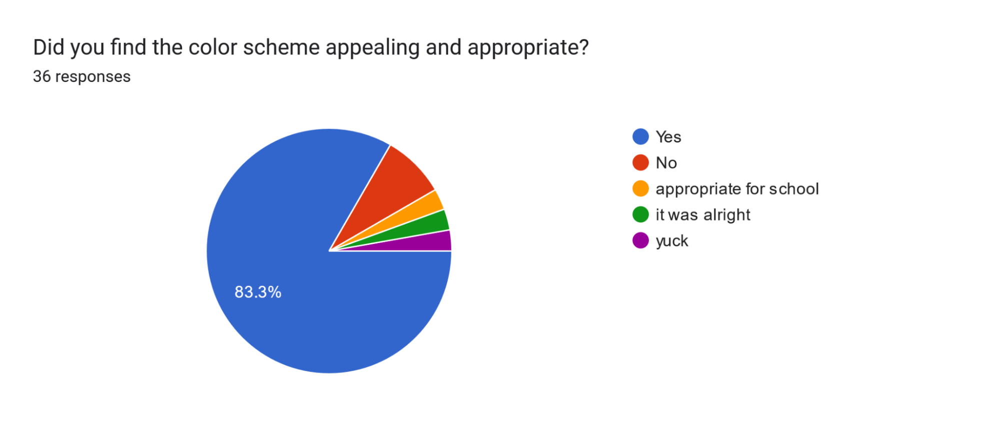 
  Fig. 8 - Comments on Appropriateness of Color Scheme

  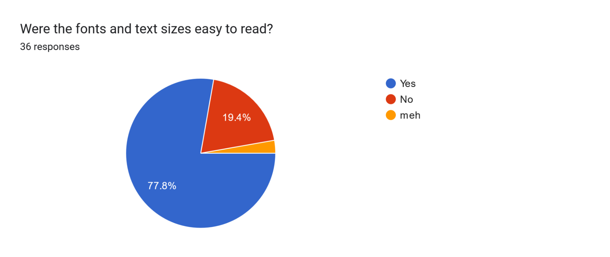 
  Fig. 9 - Comments on use of fonts

  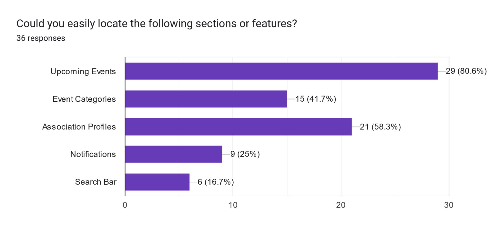 
  Fig. 10 - Feature Ease of Location

  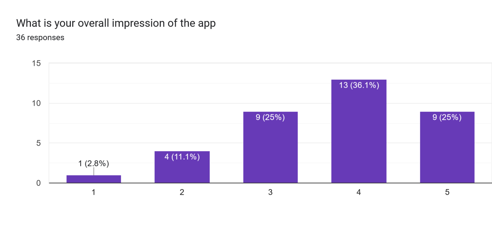 
  Fig. 11 - Overall Impression of the Website

  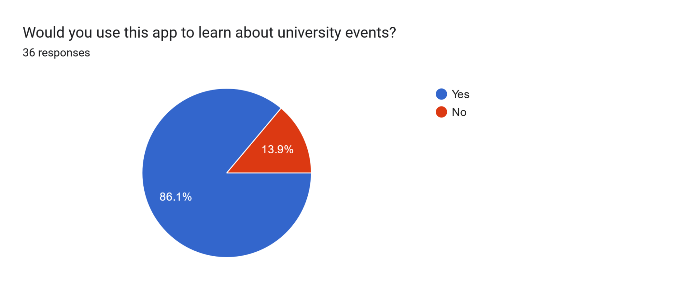 
  Fig. 12 - Using App in the Future

